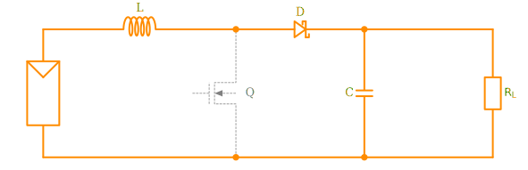
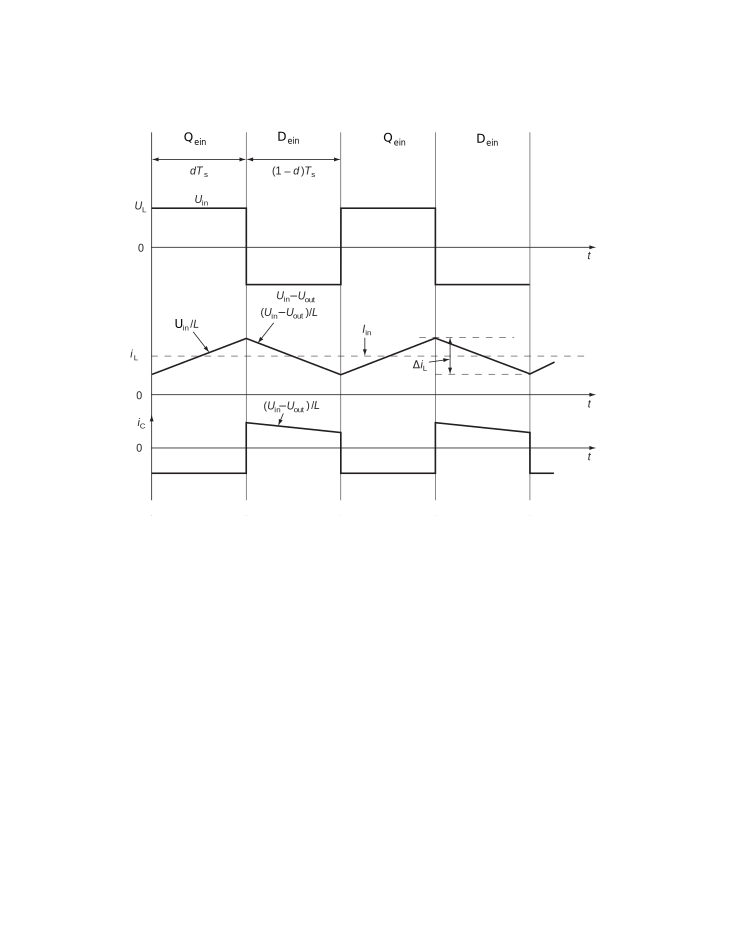
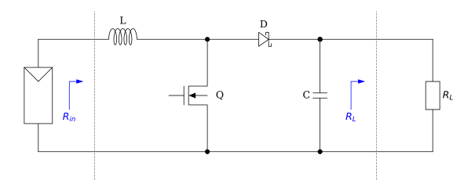

# Boost converter {#boost}

The boost converter is a DC/DC converter in which the magnitude of the output voltage is always higher than that of the input voltage. The
circuit diagram in [figure](#fig:boost1) shows the basic elements of the boost converter
and their connection with a solar cell and a load resistor. The boost
converter consists of a coil *L* at the input, a switch *Q* in the
middle, a diode *D* and capacitsor *C* at the output.

#### Figure boost converter schematic {#fig:boost1}

There are two states in the circuit:

-   switch is closed *(dTs)*

-   switch is open *(1-d)Ts*

In [figure](#fig:boost2) the switch is closed. A current flows from the
solar cell through the coil *L* and the switch *Q* to set up the
magnetic field in the coil. The diode *D* blocks the current flow from
input to output in this state. The capacitor *C* discharges its charge
to the load resistor. During this on-time *dTs*, the voltage across the
coil is $V_{pv}$ and the current increases linearly to a peak. 

#### Figure boost on time {#fig:boost2}

During the switch-off time *(1-d)Ts*, the coil tries to maintain the
current flow and to release the energy that was stored in the form of
the magnetic field. In the process, the polarity on the coil changes and
the voltage increases. The voltage across the coil is now
$(V_{pv}-V_{out})$. This causes the diode *D* to commutate because the
voltage on the side of the coil exceeds the output voltage on the
capacitor *C*, so the diode becomes conductive. The capacitor *C* at the
output of the circuit now stores this additional voltage and the
magnetic field of the coil is reduced. [Figure](#fig:boost3) shows the current flow during the off-time.
In the next time window, the switch starts again in the closed state and
the cycle begins again.

#### Figure boost off time {#fig:boost3}

If the switch is switched with a fixed period *Ts*, a voltage can be
measured at the output that is higher than the voltage at the input. To
adjust the output voltage, the duty cycle *d* is varied. The duty cycle
*d* describes the ratio between the time in the switched-on and
switched-off state.

A change in the duty cycle also causes a change in the input resistance
of the circuit. This point will be discussed in more detail in the
following, as it is important for understanding the solar opdul
optimiser.

#### Timing diagram {#fig:boost-time}

For this, the relationship between input and output voltage is first
derived by considering the voltage across the coil over both states.
With the [timing diagram](#fig:boost-time) and the assumption that the magnitude of the
voltage time surface of the coil over one period is zero, equation
\eqref{InOut} can be established. 

$$ \label{InOut}
V_{in} \cdot dT_{s} + (V_{in} - V_{out})(1-d)T_{s}=0 $$

If the equation
is transformed, the input-to-output voltage ratio we are looking for
appears with the equation
\eqref{InOutrel}.

$$ \label{InOutrel}
V_{out}=V_{in} \cdot \frac{1}{1-d} $$

For the ratio of the current across
the input and output, consider the balance of the current from the
capacitor across both states. During the on time $dTs$, the diode blocks
and the capacitor is discharged only through the load resistor. During
the off-time $(1-d)Ts$, the current from the coil flows through the
conducting diode, charging the capacitor. In addition, part of the
current goes to the load resistor. Over an entire period, current across
the capacitor can be set to zero, as given in equation
\eqref{InOutCurrent}.

$$ \label{InOutCurrent}
(-I_{out})dT_{s}+(I_{in}-I_{out})(1-d)T_{s}=0 $$

The relationship between
input and output current, after a transformation, shows the equation
\eqref{InOutrelCurrent}

$$ \label{InOutrelCurrent} I_{out}=I_{in} \cdot{1-d} $$

If the output voltage
\eqref{InOutrel} is divided by the output current
\eqref{InOutrelCurrent}, an equation \eqref{Rout} for the load
resistance can be given. The factor of the first term can be replaced by
the input resistance.

$$ \label{Rout}
R_{L}=\frac{V_{out}}{I_{out}}=\frac{V_{in}}{I_{in}} \cdot \frac{1}{(1-d)^{2}}=\frac{R_{in}}{(1-d)^{2}} $$

After a further transformation, the equation we are looking for
\eqref{Rin} can be found for
the input resistance.

$$ \label{Rin}
R_{in}=R_{L} \cdot (1-d)^{2} $$

The input resistance from
[this figure](#fig:boost_Rin) is thus dependent on the load connected to the
converter and the duty cycle. This insight is the basis for the
operation of the solar module optimiser. The next section shows how the
solar module can be operated at the optimal operating point by
modulating the duty cycle.
<!--[@IntelligentEnergy p.254][@UmanandPower p.207-213] -->

###### Figure Input Resistance {#fig:boost_Rin}
