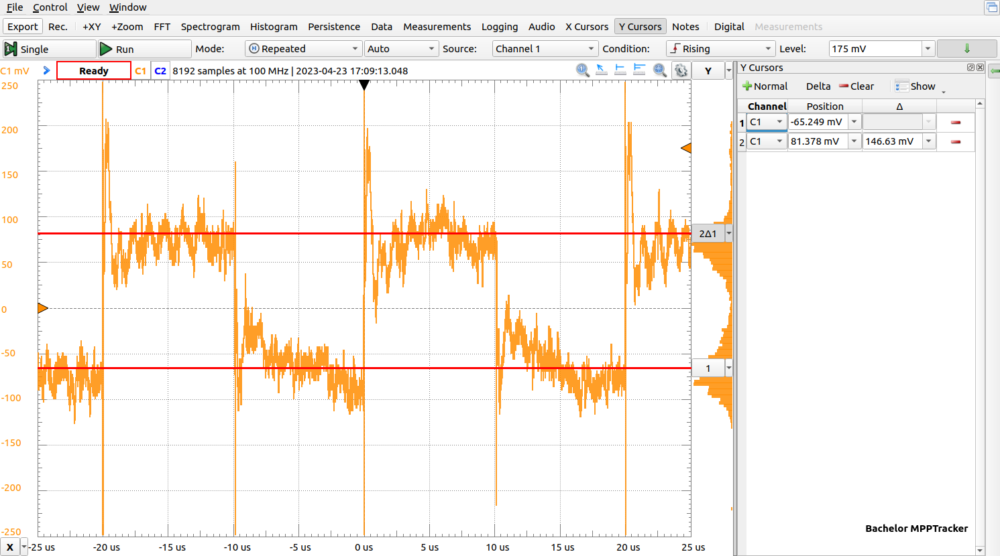

## Characteristics

First, the basic properties and functions of the boost converter are to
be investigated, for this a voltage source of $U_{source}=20V$ is
connected to the input of the module optimizer, the output is wired with
an ohmic resistor of $R_{L} = 24 \Omega$. The duty cycle is set to
$d=35\%$, this would correspond to an output voltage of $U_{out}=30.77V$
according to equations on basics chapter [boost converter](../basics/boostconverter). The practical measurement shows an output
voltage of $U_{out}=29.7V$ which seems reasonable with consideration of
conduction and switching losses and the voltage drop of about $0.4V$ of
the Schottky diode *MBRB1060*. Of further interest is the ripple of the
output voltage which is examined with an oscilloscope. A plot of the
output rippe voltage is shown in [figure](#ripple). The output voltage delta of
$\Delta U_{out}= 0.1V$ selected in the design is
$\Delta U_{out_{mess}}=0.146V$ in the measurement and is thus $46mV$
greater than required. However, this does not affect the function of the
module optimizer.

###### Output ripple voltage {#ripple}

The measurements show a DC rms value of $V_{dc_{eff}}=29.7V$ and an AC
rms value of $V_{ac_{eff}}=47.6mV$, giving a ripple of $0.16\%$
according to
\eqref{eq:schwingungsgehalt}.

$$ \label{eq:schwingungsgehalt}
r_{u} = \frac{V_{ac_{eff}}}{|V_{dc_{eff}}|} = \frac{0.0476V}{29.7V} = {1.6e-3} $$

Next, the characteristic curve of the PV-emulator is to be recorded, for this the
VI-scanner algorithm is used and extended by the recording function of
the measured data to a SD-card, furthermore the duty cycle is set
directly, thus the PI-controller is not used. The PV emulator is
operated with a current source with a limitation of $I=5A$, the VI
characteristic can be seen in pv emulator characteristics [figure](#pvemu1) and shows the typical characteristic of
an PV-module. In
addition, the power is shown on another axis, from which the global
MPP can be easily
read. This experimental test of the characteristic curve recording shows
the general functionality of the basic functions of the solar module
optimizer, in particular the measurement of voltage and current at the
solar module, the control of the duty cycle for the boost converter and
the processing of the collected data.

###### PV emulator characteristics {#pvemu1}

The VI curve with one third of the solar module shaded is shown in [shaded figure](#pvemu2). Here, the PV emulator is used again,
but with the configuration of two current sources $I_{1}=5A$ and
$I_{2}=2A$ and the two bypass diodes, where current source $I_{1}$ is connected to diodes $D_{1}$ to $D_{20}$ and current source $I_{2}$ is connected to
diodes $D_{21}$ to $D_{30}$. The VI-characteristic shows here a clearly
changed course of the current over the voltage, already at a voltage of
approx. $V_{pv}=14V$ the current breaks down from $I_{pv}=4A$ to
$I_{pv}=2A$.

While only one global MPP appears in the PV-characteristic in the experiment without
shading from [Figure](#pvemu1), two MPP become visible here. These two
MPP are also called
local MPP and are
the challenge for the next chapter [compasion](comparison), where the two algorithms are tested and
compared.

###### PV emulator characteristics shaded {#pvemu2}

