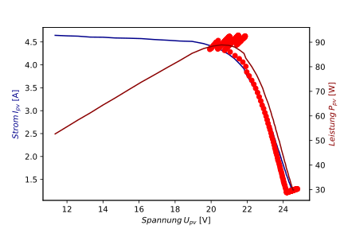
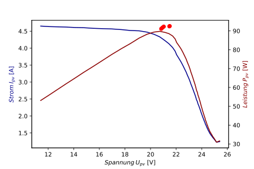

# Comparison of algorithms {#kap:algovergleich}

How the two algorithms from [this chapter](../algorithms) also
behave under shadowed conditions will be clarified in this chapter. For
this purpose, the PV
emulator is used again, but with the shadowed configuration of two
different current sources and the bypass diodes, for this the setting of
the current sources is kept. The time for the experimental frame shall
be $t=10min$ for both algorithms and the settings of the
PV emulator remain
the same, also both algorithms are tested once with and without
shadowing. A logging function is added to both algorithms, seen in
chapter [saving data](../software/savingdata), which always logs which point on the PV
characteristic is being sampled. In order to better nastand the
progression and search of the algorithms for the
MPP, the operating
points are shown together with the characteristic curves from the last [chapter](characteristics). The first experiment is performed with
the PO-algorithm and
a unshaded solar module, the red operating points are shown in [Figure](#perturb1). As expected, the algorithm scans up
to the global MPP,
and oscillates around this point in small steps.

###### Perturb and Observe basic {#perturb1}

###### Perturb and Observe shaded {#perturb2}

The algorithm can solve this task satisfactorily and shows how easy the
search for the MPP
can be implemented. However, in another experiment with a shaded solar
module, a weakness of this algorithm becomes apparent.\
\
As seen in [Figure](#perturb2), the algorithm dwells in
the local MPP at
$V_{pv}=23V$ and will never find the global MPP because its decision making is based on
the slope of the PU-characteristic. The global MPP is at $U_{pv}=13V$ and is the much more
powerful operating point.

Next, the IU scanner algorithm is tested with the normal IU
characteristic of the PV emulator without any shading. As visible in
[basic figure](#viscan1) at the red operating
points the MPP of
this characteristic curve is well hit with some small deviations, the
deviations are attributed to smaller measurement deviations and the
heating of the diodes in the PV emulator.

The test with the VI-scanner and a shadowing of the
PV emulator shows
that by scanning the characteristic line several times, the global more
powerful MPP is
easily found. The red operating points from [shaded figure](#viscan2)
coincide well this time
with the global MPP
of the shaded PV emulator.

###### VI-Scanner basic {#viscan1}

###### VI-Scanner shaded {#viscan2}

In summary, the PO
algorithm is clearly inferior to the IU scanner algorithm in terms of
the global MPP. In
return, the PO can
react faster to short-term shifts of the characteristic curve, because
here the MPP is not
set for the next 60 seconds.