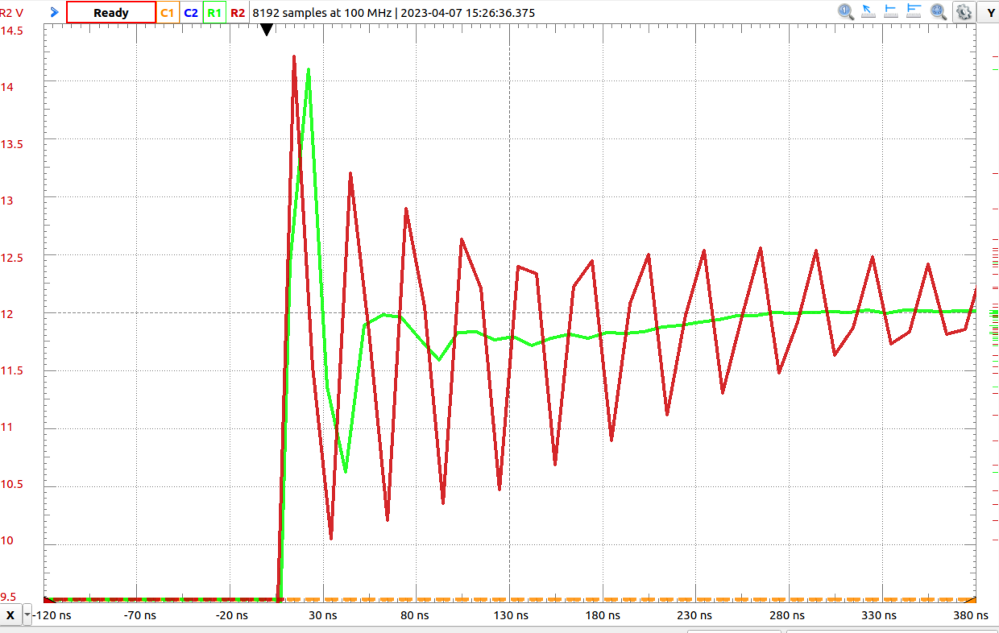

# Snubbercircuit

If an inductor is switched with a mosfet, it can lead to significant voltage
overshoots during the switch-off time and the switch-on time. When the mosfet switches off, the current of the load $iL$ drops towards zero. This causes the voltage $U_{DS}$ across the mosfet to increase to a large value due to the
phenomenon $Ldi/dt$, where $L$ can be the line inductances of the drain
and source lines. Under certain conditions, the mosfet can be
destroyed in this way. To slow down the change of voltage at the
mosfet, a capacitor $C$ is connected across the mosfet according to figure
[\[fig:snubber\]](#fig:snubber){reference-type="ref"
reference="fig:snubber"}a. The capacitor fixes the problem of voltage
spikes, but causes a new problem during the switch-on time. When the
mosfet switches on again, the capacitor is discharged via the
mosfet and this causes a large discharge current spike that can also destroy the unit.

To limit the current, the resistor $R$ is connected in series with the
capacitor. However, the resistor is only to limit the current during the
on time, it is not required during the off time. To reduce the losses
during the switch-off time, a diode $D$ is connected in parallel to the
resistor. Thus, the resistor $R$ only shows its effect during the
switch-on phase, as shown in figure
[\[fig:snubber\]](#fig:snubber){reference-type="ref"
reference="fig:snubber"}b [@UmanandPower p.80][@IntelligentEnergy
p.261].

There are different ways to determine the values for $R_{snub}$ and
$C_{snub}$. Here, a way will be shown that is based on the assumption
that the parasitic inductances of the supply lines and the capacitances
of the free-wheeling diode of the mosfet form an RLC filter that resonates at a
certain frequency. The basis for the procedure is the measurement of the
resonance frequency with an oscilloscope. The course of the measurement
is shown in red in figure
[\[fig:snubber-ring\]](#fig:snubber-ring){reference-type="ref"
reference="fig:snubber-ring"}. The resonant frequency of
$f_{c} = 31.25 Mhz$ is determined from the period of the oscillation.
Then the dominant part of the circuit is determined. The inductance of
the supply line is dominant if it is a low-side switch. The capacitance
of the body diode of the mosfet or the capacitance of the free-wheeling
diode is dominant if it is a high-side switch. The solar module
optimiser works as a low-side switch, so the quantity sought is the
parasitic inductance of the supply line and the capacitance of the
free-wheeling diode can be neglected. The parasitic inductance is
determined with the help of an impedance analyser, which is connected to
the input terminals of the circuit and measures the impedance at
different frequencies. The measurement shows that at the resonance
frequency the parasitic inductance is $L_{para} = 10nH$. With the
equation [\[Rsnub\]](#Rsnub){reference-type="ref" reference="Rsnub"} the
value for the resistance $R_{snub}$ is determined.

$$\label{Rsnub}
R_{snub} = 2 \pi f_{c} L_{para}=2\cdot\pi\cdot31,25 Mhz\cdot10 nH = 1,96 \Omega$$

The capacitor $$C_{snub}$$ can be chosen large for high damping, but this
also increases the losses in the capacitor during the switching process.
Therefore, the maximum power loss is set to $P_{loss} = 60mW$ when using
0805 package SMD components. The equation
([\[Csnub\]](#Csnub){reference-type="ref" reference="Csnub"}) calculates
the maximum capacitance for the snubber capacitor considering the power
dissipation. The voltage applied to the capacitor is measured as
$U_{C_{snub}}=25V$ and the switching frequency is $f_{s}=50 kHz$.

$$ \label{Csnub}
C_{snub} = \frac{P_{loss}}{U_{Csnub}}^{2} \cdot {f_{s}} = \frac{60 mW}{(25V)}^{2} \cdot {50 kHz} = 1,92 nF $$

The figure
[\[fig:snubber-ring\]](#fig:snubber-ring){reference-type="ref"
reference="fig:snubber-ring"} shows the voltage $U_{DS}$ across the
mosfet measured
with an oscilloscope, without snubbercircuit in red and in comparison to
this with the snubbercircuit of the calculated values in green. A
considerable damping of the oscillation can be observed [@biricha].

