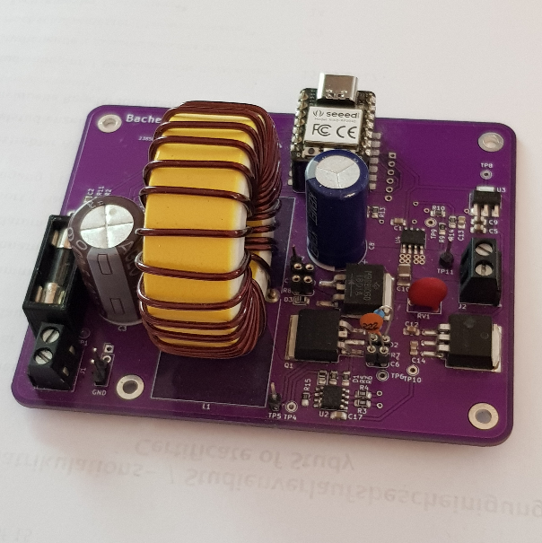

# Mushroom MPPT Solarmodule optimizer

#### Open Source Project by Arne Christian Schmidt

[View it on Github](https://github.com/dulouie/mushroom_mppt){: .btn .btn-purple .mr-2 }
[View Slides](https://dulouie.github.io/mushroom_mppt/){: .btn .btn-blue }

### Implementation of a programmable solar module optimiser to investigate different MPPT algorithms in the presence of shading

This project is the open source continuation of my bachelor thesis, it deals with the development of a programmable solar
module optimizer capable of testing and evaluating different
MPPT-algorithms
using higher level programming language.

The goal of the project is to
develop a platform for the comparison of MPPT-algorithms. For this purpose, the
required components and circuits will be selected and implemented. The
components used will be addressed and the software for the control by a
microcontroller will be implemented. The programmable approach offers
the possibility to test different algorithms in different environments
and conditions and to evaluate their effectiveness.

This is finally
carried out with two algorithms. The use of the Micropython programming
language facilitates implementation and enables faster prototype
development. The development of this solar module optimizer is intended
to make solar energy accessible to a wider circle of developers.
